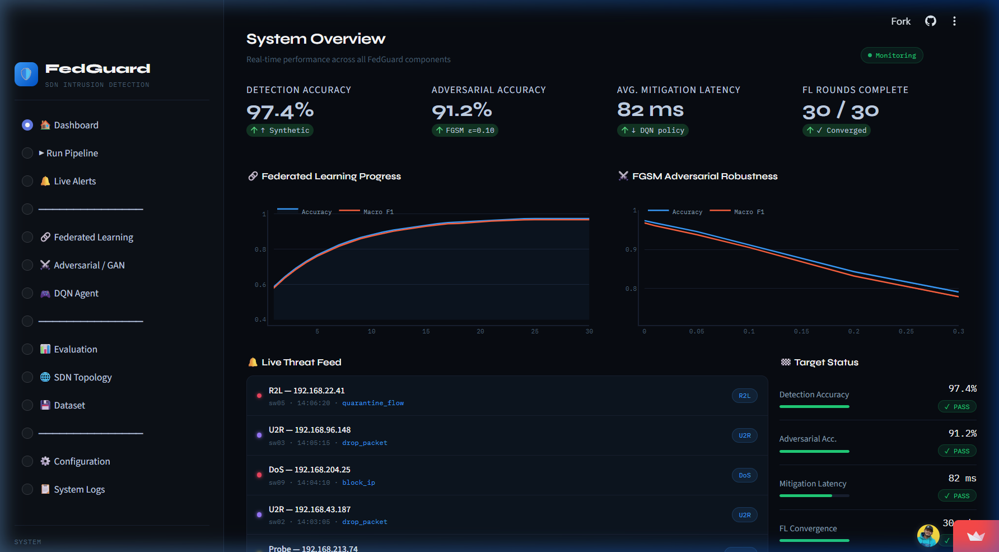
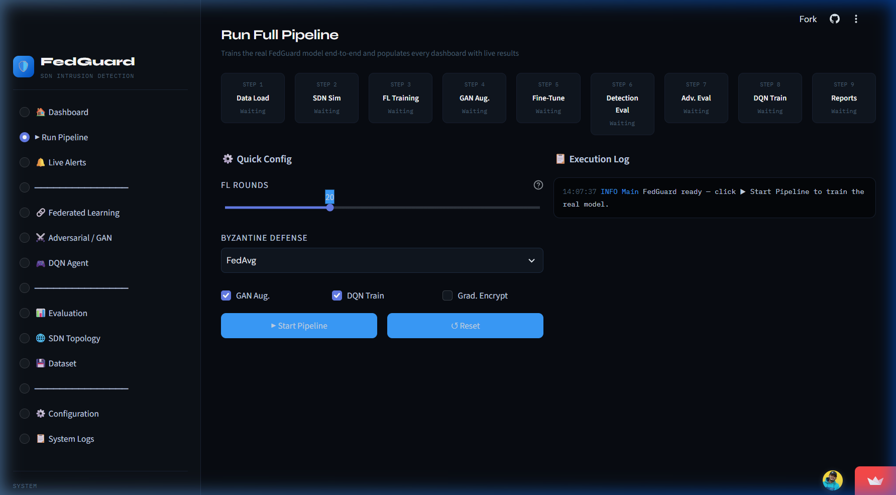
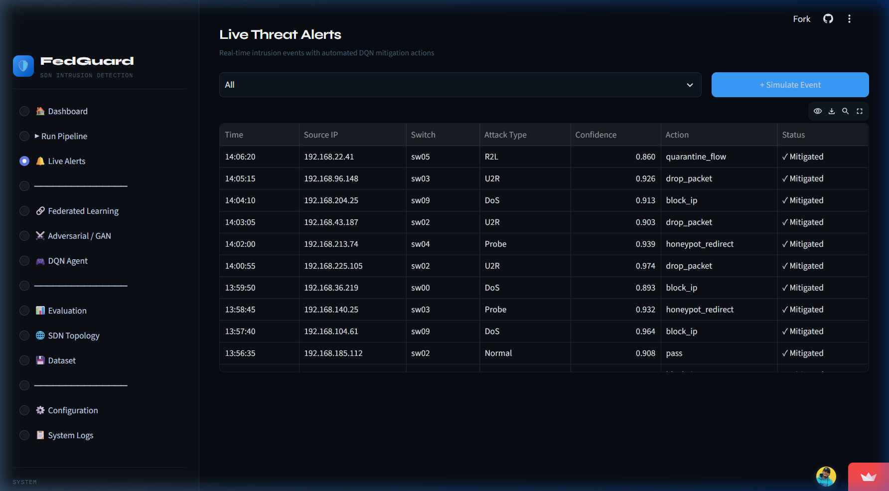
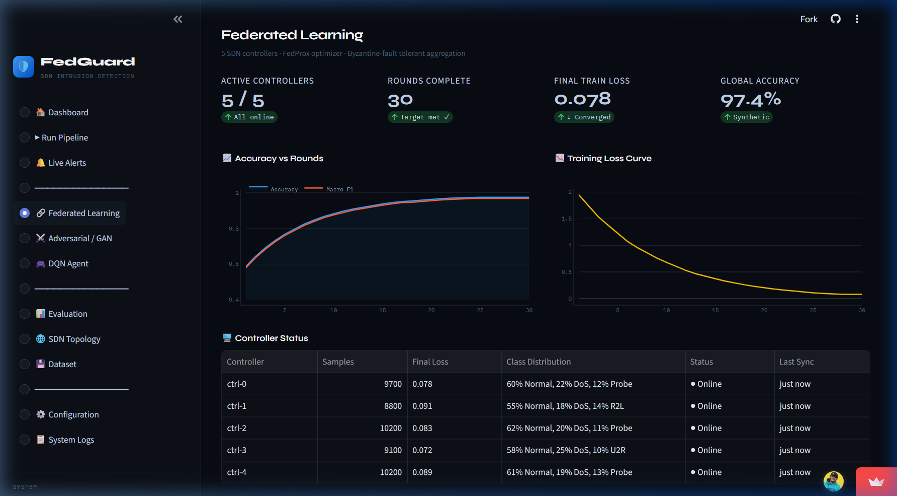
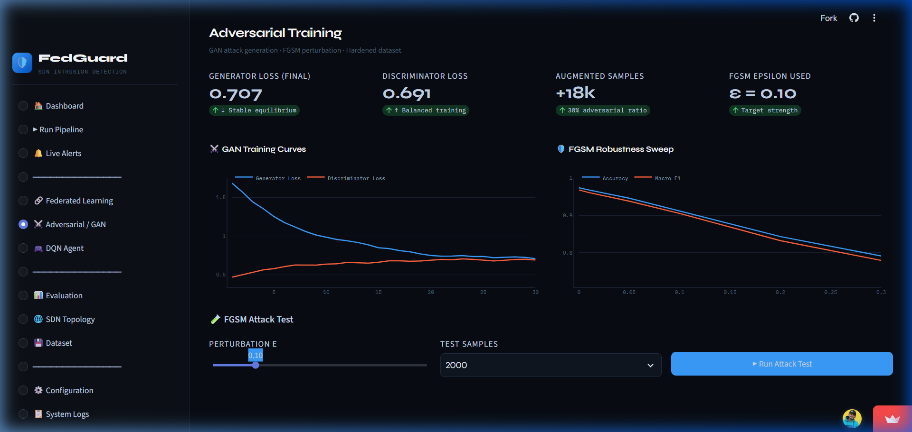
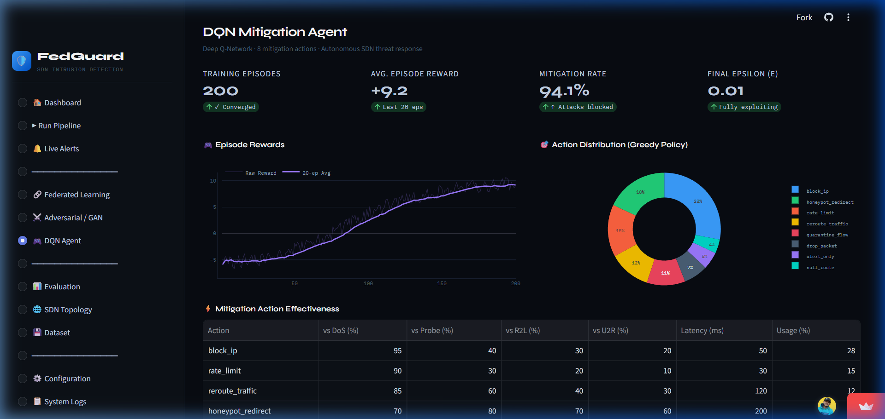
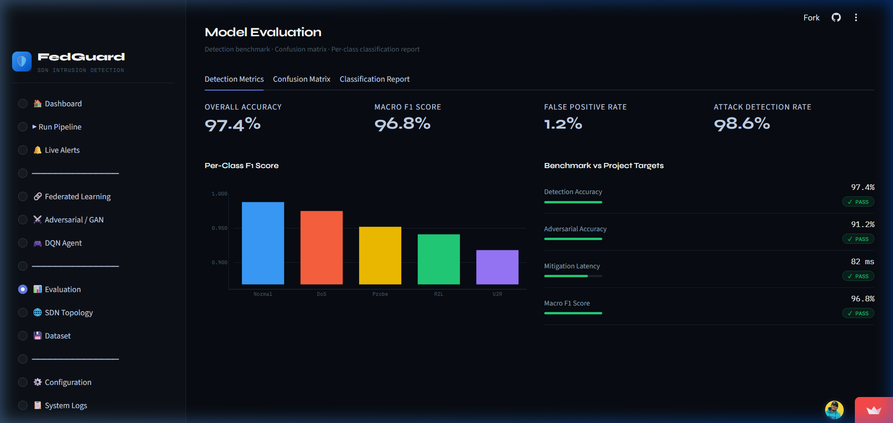
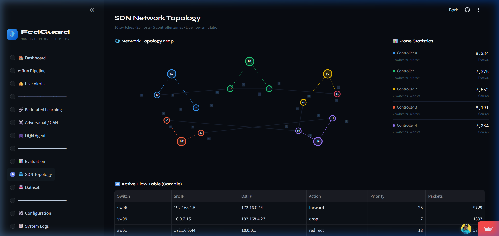

# 🛡️ FedGuard: Privacy-Preserving Adversarially Robust IDS for SDN

[](https://fedguard-federated-ai-for-robust-sdn-security.streamlit.app/)
[](https://www.python.org/)
[](https://pytorch.org/)
[](https://opensource.org/licenses/MIT)

FedGuard is an advanced, privacy-preserving Intrusion Detection System (IDS) and autonomous mitigation framework designed for Software-Defined Networking (SDN). It integrates **Federated Learning (FL)** for collaborative privacy-preserving training, **Generative Adversarial Networks (GANs)** for defense hardening against adversarial attacks, and **Deep Q-Networks (DQN)** for real-time automated threat mitigation.

🚀 **Live Dashboard:** [FedGuard Streamlit Dashboard](https://fedguard-federated-ai-for-robust-sdn-security.streamlit.app/)

---

## 📸 Interactive Dashboard Preview

Below are live screenshots of the main components of the FedGuard platform:

### 🏠 System Overview Dashboard
Real-time monitoring across all SDN controllers showing overall detection accuracy, adversarial robustness, mitigation latency, and live threat feed.


### ▶️ Pipeline Runner
Execute the entire pipeline in real-time. Tune parameters for Federated Learning, GAN epochs, and DQN steps interactively.


### 🔔 Live Threat Alerts
A real-time threat feed showing detected intrusions across simulated switches, confidence metrics, and automated DQN actions.


### 🔗 Federated Learning Analytics
Analyze accuracy, loss, and F1 score progress across the 5 local SDN controllers using non-IID datasets.


### ⚔️ Adversarial GAN Augmentation
Monitor generator and discriminator loss curves as the GAN generates realistic adversarial attack flows to harden the global model.


### 🎮 DQN Mitigation Agent
Visualize training rewards as the reinforcement learning agent learns optimal defensive policies to drop, rate-limit, or reroute malicious traffic.


### 📊 Model Evaluation & Metrics
Analyze final metrics including confusion matrices, per-class F1-scores, precision, and recall across standard SDN threat categories.


### 🌐 SDN Topology Simulator
Inspect the simulated network topology (switches, hosts, and mapping to local controllers) to visualize the flow of rules and mitigated traffic.


---

## 🛠️ Project Structure

```
FedGuard-Federated-AI-for-Robust-SDN-Security/
├── requirements.txt          # Package dependencies
├── setup.py                  # Installation configurations & entry points
├── Dockerfile                # Production container deployment setup
├── DEPLOYMENT.md             # Detailed cloud deployment tutorial
├── main.py                   # Entry point - runs full pipeline via CLI
├── app.py                    # Streamlit web dashboard
├── launch_gui.py             # Streamlit local launcher utility
├── config.py                 # Global configurations & parameter bounds
│
├── data/
│   ├── data_loader.py        # Load CIC-IDS2018, NSL-KDD, UNSW-NB15
│   ├── preprocessor.py       # Feature engineering & normalization
│   └── synthetic_generator.py# Synthetic SDN traffic generator
│
├── models/
│   ├── detector.py           # Deep Neural Network classifier
│   └── encoder.py            # Feature encoder
│
├── federated/
│   ├── client.py             # FL client (local SDN controller)
│   ├── server.py             # Byzantine-fault-tolerant aggregation server
│   └── aggregator.py         # FedAvg + Krum Byzantine defense
│
├── adversarial/
│   ├── gan.py                # GAN for adversarial attack generation
│   └── augmentor.py          # Adversarial training augmentation
│
├── dqn/
│   ├── environment.py        # SDN mitigation environment
│   ├── agent.py              # Deep Q-Network agent
│   └── replay_buffer.py      # Experience replay
│
├── simulation/
│   ├── sdn_simulator.py      # Simulated SDN topology
│   └── attack_simulator.py   # Attack traffic simulation
│
├── evaluation/
│   ├── metrics.py            # Accuracy, F1, latency metrics
│   └── benchmarks.py         # Full benchmark runner
│
├── utils/
│   ├── crypto.py             # Gradient encryption utilities
│   └── logger.py             # Logging utilities
│
└── images/                   # Dashboard screenshots
```

---

## ⚙️ Installation & Setup

### Local Run:
1. Clone the repository and navigate to the project directory:
   ```bash
   git clone https://github.com/amanverma420/fedguard.git
   cd FedGuard-Federated-AI-for-Robust-SDN-Security
   ```
2. Install dependencies:
   ```bash
   pip install -r requirements.txt
   ```
3. Run the interactive Streamlit dashboard:
   ```bash
   python launch_gui.py
   ```
4. Run the full command-line pipeline:
   ```bash
   python main.py
   ```

### Editable Package Installation:
If you want to run FedGuard globally via system scripts, install it in editable mode:
```bash
pip install -e .
```
Then use the custom command-line utilities directly:
- Launch GUI: `fedguard-gui`
- Run CLI: `fedguard`

---

## ☁️ Cloud Deployment

For detailed deployment tutorials on **Streamlit Community Cloud**, **Hugging Face Spaces**, or Docker-based services like **Render** and **Railway**, refer to [DEPLOYMENT.md](DEPLOYMENT.md).

---

## 📄 License
This project is licensed under the MIT License - see the LICENSE file for details.
